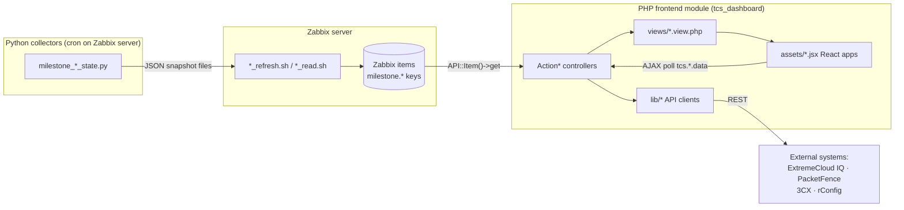

# Code Overview — PHP & Python Hierarchy and Interconnections

This document maps the PHP and Python code in this repository: what each layer does,
how the pieces call each other, and where the two languages meet. It reflects the code
as of version 1.3.0 of the module.

**The big picture:** the repo ships a Zabbix frontend module (`tcs_dashboard/`) written
in PHP that renders custom operations dashboards, plus a set of Python collector scripts
(`tcs_dashboard/zabbix/milestone/`, `scripts/`) that run *outside* the web app — on the
Zabbix server via cron — and feed data into Zabbix items. **PHP and Python never call
each other directly.** They are connected through Zabbix itself: Python writes JSON
snapshots that Zabbix external-script items ingest, and PHP reads those item values back
through the Zabbix API (`API::Item()->get`, `API::History()->get`).



---

## 1. Repository layout

```
ZabbixCustomDashboard/
├── readme.md                         Top-level install/overview docs
├── LICENSE
├── scripts/
│   └── probe_pf_radius_audit_logs.py PacketFence API diagnostic (standalone)
└── tcs_dashboard/                    The Zabbix frontend module (drop into modules/)
    ├── manifest.json                 Registers 41 tcs.* actions → classes → views
    ├── Module.php                    Adds 15 menu entries under Monitoring
    ├── actions/                      44 PHP controllers (pages, JSON endpoints, write actions)
    ├── lib/                          6 PHP client classes for external APIs
    ├── views/                        19 PHP view templates (one per page)
    ├── assets/                       React/JSX frontend apps + CSS (loaded by views)
    ├── templates/                    Zabbix template export (server forks by agent)
    ├── notes/                        Integration plans + Zabbix template patches (YAML)
    └── zabbix/milestone/             Python collectors + shell wrappers + Zabbix templates
        ├── milestone_cameras_state.py / milestone_rs_state.py / milestone_ess_state.py
        ├── milestone_ess_lookup.py / milestone_ess_resolve.py   (diagnostics)
        ├── milestone_*_refresh.sh / milestone_*_read.sh          (cron + item wrappers)
        ├── template_milestone_rs_extras.yaml
        └── zbx_export_templates (6).yaml
```

---

## 2. PHP — the Zabbix frontend module

### 2.1 Bootstrap layer

- **`Module.php`** (`Modules\TcsDashboard\Module extends CModule`) — registers 15 menu
  items under Zabbix's *Monitoring* menu (TCS Global, Wireless APs, XIQ Status, Switches,
  FortiGate, Servers, Zabbix Status, VoIP·3CX, Cortex XDR, four PacketFence pages,
  Surveillance), each pointing at a `tcs.*.view` action.
- **`manifest.json`** — the routing table. Maps 41 `tcs.*` action names to controller
  classes. Two kinds:
  - `layout.htmlpage` + a view → full pages (`tcs.global.view`, `tcs.switches.view`, …)
  - `layout.json`, no view → AJAX JSON endpoints (`tcs.global.data`, `tcs.voip.calls.data`, …)
    and write actions (`tcs.switch.cyclepoe`, `tcs.xiq.ap.reboot`, `tcs.pf.device`,
    `tcs.events.update`, `tcs.camera.snapshot`).

### 2.2 Controller hierarchy (`actions/`, 44 files)

Class inheritance:

```
CController (Zabbix core)
├── ActionBase                  ← all *.view page controllers
│   │   (disables CSRF, redirects unauthenticated users to login, requires ZABBIX_USER)
│   ├── ActionGlobal, ActionDashboard, ActionSwitches, ActionXiq, ActionFortigate,
│   ├── ActionServers, ActionServer, ActionZbxStatus, ActionVoip, ActionXdr,
│   ├── ActionEvents, ActionProblems, ActionSurveillance, ActionCamera,
│   └── ActionPfClients / PfNac / PfSessions / PfQuarantine / PfStatus
├── ActionDataBase              ← all *.data JSON endpoints
│   │   (returns HTTP 401 JSON on expired session so pollers detect it)
│   ├── ActionGlobalData, ActionDashboardData, ActionSearchData,
│   ├── ActionSwitchesFleetData / SnapshotData / PortHistoryData / XiqData,
│   ├── ActionXiqData, ActionServersData, ActionZbxStatusData, ActionFortigateData,
│   ├── ActionVoipData / VoipCallsData / VoipTopData,
│   ├── ActionEventsData / EventsUpdate / ProblemsData,
│   └── ActionSurveillanceData, ActionCameraData, ActionCameraSnapshot
└── (direct CController, ADMIN-only write actions)
    ├── ActionPfDevice          PacketFence node actions (reevaluate access, restart port)
    ├── ActionXiqApReboot       Reboot an AP via ExtremeCloud IQ
    └── ActionSwitchCyclePoe    Cycle PoE on a switch port via rConfig
```

Functional areas, one row per page (view controller + its data endpoints):

| Area | Page controller → view | Data / write endpoints | Data sources |
|---|---|---|---|
| **Global NOC** | `ActionGlobal` → `global.view` | `ActionGlobalData` (`stage=core\|enrich`) | Zabbix API (hosts, problems, `Site/*` groups), `xiq.ap.*` items, `milestone.cam.status[*]` items, 3CX via `ThreeCXClient` |
| **AP Detail (Wireless)** | `ActionDashboard` (2 045 lines, ~25 collectors) → `dashboard.view` | `ActionDashboardData` (reuses `ActionDashboard`'s private collectors via reflection) | Zabbix API (`extremeap.*`, `net.if.*`, `icmpping*` items), `XIQClient` (live clients), `PFClient` (uplink/NAC) |
| **XIQ fleet** | `ActionXiq` → `xiq.view` | `ActionXiqData`; write: `ActionXiqApReboot` | `xiq.devices.raw` script item + `xiq.ap.*[<serial>]` items, `XIQFleetClient`, `XIQClient` |
| **Switches** | `ActionSwitches` → `switches.view` | `ActionSwitchesFleetData`, `…SnapshotData`, `…PortHistoryData`, `…XiqData`; write: `ActionSwitchCyclePoe` | `SwitchClient` (EXOS SNMP template items: `stacking.member[]`, `net.if.status[ifOperStatus.*]`, `snmp.interfaces.poe.dstatus[]`), `PFClient` (FDB→NAC join), `XIQClient`/`XIQFleetClient`, `RConfigClient` |
| **FortiGate** | `ActionFortigate` → `fortigate.view` | `ActionFortigateData` | Zabbix API only — "FortiGate by SNMP" template items (`fgSysCpuUsage.0`, `fgVpn*`, `fgIf*`) |
| **Servers** | `ActionServers` → `servers.view` | `ActionServersData` | Zabbix API only (`system.cpu.util`, `vm.memory.utilization`, `vfs.fs.size[`, `proc.*`) |
| **Zabbix status** | `ActionZbxStatus` → `zbx.status.view` | `ActionZbxStatusData` | Zabbix API only — "Zabbix server/proxy health" templates (`zabbix[*]`, `proc.num[*]`), HA nodes, proxies |
| **VoIP (3CX)** | `ActionVoip` → `voip.view` | `ActionVoipData` (30 s), `ActionVoipCallsData` (5 s), `ActionVoipTopData` | `ThreeCXClient` (XAPI), Zabbix history of the 3CX template's active-calls item |
| **Events / Problems** | `ActionEvents` → `events.view`; `ActionProblems` → `problems.view` | `ActionEventsData`, `ActionProblemsData`; write: `ActionEventsUpdate` (`API::Event()->acknowledge`) | Zabbix API only |
| **Surveillance (Milestone)** | `ActionSurveillance` → `surveillance.view` | `ActionSurveillanceData` (1 736 lines, staged) | Zabbix API — the whole `milestone.*` item tree **populated by the Python collectors** (§4), plus `PFClient` for camera NAC enrichment |
| **Camera / RS detail** | `ActionCamera` → `camera.view`; `ActionServer` → `server.view` | `ActionCameraData` (wraps `ActionSurveillanceData::collectCameraDetail`), `ActionCameraSnapshot` (JPEG proxy: `curl` to `https://<camera-ip>/snap.jpg` with `{$TCS.CAM.USER}/{$TCS.CAM.PASS}`) | Zabbix API, direct HTTPS to camera |
| **PacketFence pages** | `ActionPfClients/Nac/Sessions/Quarantine/Status` → `pf.*.view` | write: `ActionPfDevice` | View pages are static mock (`packetfence-data.jsx`); `ActionPfDevice` calls PacketFence REST via `PFClient` |
| **Search** | — | `ActionSearchData` | Zabbix hosts + `PFClient::searchNodesText` + `XIQFleetClient` clients |
| **XDR** | `ActionXdr` → `xdr.view` | — | Static mock (`xdr-data.jsx`); Cortex XDR not yet wired |

Notable internal patterns:

- **Reflection reuse** — `ActionDashboardData`, `ActionSwitchesFleetData`, and
  `ActionSwitchesSnapshotData` instantiate their sibling page controller and invoke its
  private `collect*` methods via PHP reflection, so page boot (SSR) and AJAX refresh share
  one collector implementation.
- **Boot-then-poll** — page controllers embed a JSON snapshot into the view as
  `window.*_BOOT`; the JSX apps then poll the matching `tcs.*.data` endpoint.
- **Config via Zabbix macros** — credentials for every external system come from global/
  template/host user macros (`{$XIQ_API_TOKEN}`, `{$PF.URL/USER/PASSWORD}`,
  `{$TCS.3CX.*}`, `{$RCONFIG.*}`, `{$TCS.CAM.*}`), resolved with `API::UserMacro()->get`.
- **No shell-outs** — no controller uses `exec()`/`shell_exec()`. Script names like
  `milestone_cameras_read.sh` appearing in PHP are Zabbix *item keys* being searched,
  not commands.

### 2.3 API client library (`lib/`, 6 classes, namespace `Modules\TcsDashboard\Lib`)

| Class | Wraps | Auth / config | Used by (actions) |
|---|---|---|---|
| `XIQClient` (2 681) | ExtremeCloud IQ REST — **per-device** AP queries (device, SSIDs, wifi stats, clients, floorplan, reboot) | `fromToken()` / `fromCredentials()` (JWT); macros `{$XIQ_API_TOKEN}`/`{$XIQ_USERNAME}`/`{$XIQ_PASSWORD}`; APCu + `/tmp/zabbix_xiq_cache/` fallback; rate-limit aware | ActionDashboard, ActionXiqApReboot, ActionSwitchesXiqData |
| `XIQFleetClient` (840) | ExtremeCloud IQ REST — **fleet-wide** lists (`/devices`, `/clients/active`, policies, usage grid) | `fromToken()`; `resolveToken()` chain: macro → token file `/etc/zabbix/tcs_dashboard/xiq_api_token` → env; APCu cache, `curl_multi` fan-out | ActionXiqData, ActionSwitchesXiqData, ActionSearchData |
| `PFClient` (755) | PacketFence v15 REST (NAC): node lookup, locations, auth failures, `reevaluateAccess`, `restartSwitchport` | `fromMacros()` (`{$PF.*}`); token via `/api/v1/login`, APCu + `/tmp` fallback | ActionDashboard, ActionPfDevice, ActionSearchData, ActionSwitchesSnapshotData, ActionSurveillanceData |
| `SwitchClient` (1 537) | **No HTTP** — reads Extreme EXOS switch state purely from Zabbix items/history (`API::Item`, `API::History`): stack members, port/PoE status, FDB, KPIs, traffic | Implicit frontend session; no credentials | ActionSwitches, ActionSwitchesSnapshotData, ActionSwitchesPortHistoryData |
| `ThreeCXClient` (316) | 3CX v18/v20 XAPI (PBX): system status, trunks, active calls, queues, top extensions | `fromMacros()` (`{$TCS.3CX.*}`); OAuth2 client-credentials, APCu token cache | ActionVoipData, ActionVoipCallsData, ActionVoipTopData, ActionGlobalData |
| `RConfigClient` (253) | rConfig v7 API: resolve device id, deploy stored snippet (drives the PoE-cycle button) | Constructor `(url, token)`, custom `apitoken:` header, HTTPS enforced; no cache | ActionSwitchCyclePoe |

The clients are independent of one another (the only deliberate pairing:
`PFClient::canonMac()` mirrors `SwitchClient::normalizeMac()` so FDB↔PacketFence MAC
joins line up).

### 2.4 Views (`views/`, 19 files) and assets

Every view follows one template: hide Zabbix chrome → load module CSS →
`<div id="root">` → serialize the controller's `$data['boot']` into a `window.*_BOOT`
global plus `window.TCS_*_URL` endpoint URLs → load React (CDN + Babel for most pages;
`global.view.php` uses vendored/prebuilt `assets/vendor/` + `assets/dist/` for air-gapped
use) → load the page's JSX chain (`tweaks-panel → primitives → global-nav → <page>-bridge
→ <page>-app`). The `*-bridge.jsx` unpacks the boot payload and polls the `tcs.*.data`
endpoints listed in §2.2. Five pages (the four PacketFence views + XDR) currently render
entirely from static mock JSX data with no polling.

---

## 3. Python — collectors and diagnostics

### 3.1 Milestone XProtect collectors (`tcs_dashboard/zabbix/milestone/`)

These run on the **Zabbix server**, not in the web app. Shared operational pattern:

```
cron → milestone_*_refresh.sh ──runs──▶ milestone_*_state.py ──OAuth2 password grant──▶ Milestone API Gateway
                    │                                            (client_id GrantValidatorClient)
                    └─atomic write─▶ /var/lib/zabbix/milestone_*_state.json
Zabbix external item  milestone_*_read.sh[3600] ──cat + staleness guard──▶ item value (JSON blob)
        └─ LLD walks $.__array[*]; dependent items JSONPath $["<guid>"] per object
```

| Script | Purpose | Output |
|---|---|---|
| `milestone_cameras_state.py` (960) | Pages `/api/rest/v1/hardware?includeChildren=cameras`; flattens hardware→camera tree; stamps each camera with `address`, `mac`, `hardwareId/Name/Model`, `recordingServerId`, `groupName` (from `/cameraGroups`) | JSON: `__array` (for LLD) + one root key per camera GUID (for dependent items); `__count`, `__fetched_at` diagnostics |
| `milestone_rs_state.py` (283) | Recording-server state: service state, camera/hardware counts, storage totals/retention from `/recordingServers` + `/storages` + `/hardware` | Same dual shape (`__array` + per-GUID keys), plus `__storages` flat list; writes its own file with flock + atomic replace |
| `milestone_ess_state.py` (373) | Live per-camera state via the **Events & State WebSocket API** (`wss://…/api/ws/events/v1`, deps: `websockets`, `aiohttp`); subscribes to all camera events, calls `getState`, pivots by camera GUID | JSON `{count, cameras: {<guid>: {states, by_group: {<stategroupid>: {type, time}}}}}`; `--list-stategroups` diagnostic mode |
| `milestone_ess_lookup.py` (146) | Diagnostic: dump one camera's ESS record + cross-fleet type distribution. **Imports `fetch_state`/`pivot_by_camera` from `milestone_ess_state.py`** — the only Python↔Python import in the repo | Human-readable text |
| `milestone_ess_resolve.py` (161) | Enriches `--list-stategroups` output with human names from the `/eventTypes` Config API — used to pick the `{$MILESTONE.ESS.*}` macro GUIDs | JSON with `stategroup_name`/`type_name` per pair |

All take `host username password` as CLI args (no shared config module or env vars);
each implements its own OAuth2 password-grant token fetch.

### 3.2 PacketFence probe (`scripts/probe_pf_radius_audit_logs.py`, 248)

A standalone diagnostic (env vars `PF_URL/PF_USER/PF_PASS`) that probes which
`radius_audit_logs` endpoint shape a given PacketFence release serves. It exists to debug
`PFClient::authFailuresForNode()` (`tcs_dashboard/lib/PFClient.php`), which posts to
`/api/v1/radius_audit_logs/search`. No data handoff — it never feeds Zabbix or PHP.

---

## 4. PHP ↔ Python interconnection (via Zabbix items)

The two languages meet only at Zabbix item keys. Python (through the shell wrappers and
the templates in `zabbix/milestone/*.yaml`) *produces* the values; PHP
`ActionSurveillanceData.php` is the sole consumer, reading them with
`API::Item()->get(['search' => ['key_' => 'milestone.']])` and parsing keys by regex.

| Python producer | Zabbix item keys (template-defined) | PHP consumer |
|---|---|---|
| `milestone_rs_state.py` → `milestone_rs_read.sh[3600]` | `milestone.rs.state[<rsId>]`, `milestone.rs.cameracount[…]`, `milestone.rs.hardwarecount[…]`, `milestone.rs.storage.total.bytes/…used.bytes/…retention.minutes[…]`; LLD `milestone.rs.extras.discovery` ($.__array), `milestone.rs.storage.discovery` ($.__storages) | `ActionSurveillanceData` — regex `^milestone\.rs\.([a-z.]+)\[…\]` → `buildServers()` (RS health cards) |
| `milestone_cameras_state.py` → `milestone_cameras_read.sh[3600]` | `milestone.cam.address[<camId>]`, `milestone.cam.rsid[…]`, `milestone.cam.group[…]`, `milestone.cam.status[…]` (bit-sum: 0 OK / 1 ESS fault / 2 ping down / 3 both); LLD `milestone.cameras.discovery` | `ActionSurveillanceData` — regex `^milestone\.cam\.([a-z.]+)\[…\]` → `buildCameras()`; plus `findCameraGroupNamesFromSnapshot()` reads the raw `milestone_cameras_read.sh` blob's `__array[].groupName` for the camera navigator. `ActionGlobalData` also reads `milestone.cam.status[*]` for the Global surveillance KPI |
| `milestone_ess_state.py` → `milestone_ess_read.sh[]` | `milestone.cam.ess.raw[<camId>]` → `milestone.cam.ess.comm.type/…comm.time/…rec.type[<camId>]` (JSONPath into the script's `by_group` map, keyed by `{$MILESTONE.ESS.STATEGROUP.*}` macros); these feed the calculated `milestone.cam.status`/`.alarm` items | Same `milestone.cam.*` regex path in `ActionSurveillanceData` (camera up/recording state) |
| `milestone_ess_state.py --list-stategroups` + `milestone_ess_resolve.py` | *Configuration, not data*: operators use them to discover the GUID values for the `{$MILESTONE.ESS.STATEGROUP.COMMUNICATION/RECORDING}` and `{$MILESTONE.ESS.TYPE.*}` template macros | — (feeds template config the items above depend on) |
| `probe_pf_radius_audit_logs.py` | — (prints a report; targets the same PF endpoint as `PFClient::authFailuresForNode`) | — (development aid only) |

Related but non-Python: the `milestone.grp.*` / `milestone_groups_read.sh[3600]` group
snapshot consumed at `ActionSurveillanceData::collectSiteItems()` comes from a
`milestone_groups_refresh.sh` pipeline whose collector script is not in this repo, and
the `milestone.site.*` / `milestone.license.get` keys come from the "Milestone XProtect
by HTTP" template's native HTTP items.

---

## 5. External systems map

| System | Reached by | Direction |
|---|---|---|
| **Zabbix API** | every data controller; `SwitchClient` | read (+ `ActionEventsUpdate` ack writes) |
| **ExtremeCloud IQ** | `XIQClient`, `XIQFleetClient`; also indirectly via `xiq.devices.raw`/`xiq.ap.*` template items | read + AP reboot |
| **PacketFence** | `PFClient`; probed by `probe_pf_radius_audit_logs.py` | read + node actions |
| **Milestone XProtect** | Python collectors (REST + WebSocket) → Zabbix items → PHP | read only |
| **3CX** | `ThreeCXClient` | read only |
| **rConfig** | `RConfigClient` | snippet deploy (PoE cycle) |
| **Cameras (direct)** | `ActionCameraSnapshot` (`https://<ip>/snap.jpg`) | read (image proxy) |
